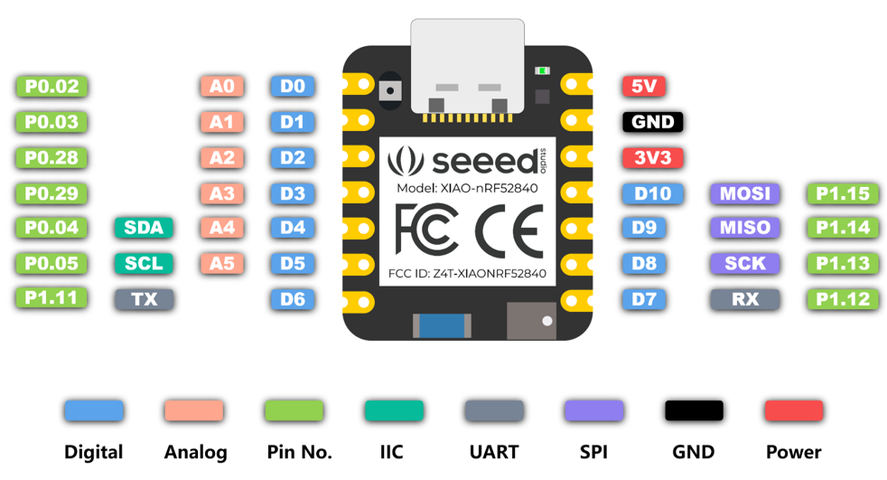

[](https://www.gnu.org/licenses/gpl-3.0)
# ant_network_processor 
The ANT Network Processor reference design is provided as a drop-in example for the Nordic nRF5 SDK. You can find the original and unmodified source [here](https://www.thisisant.com/resources/nrf52-network-processor-source/). 

For the functionality and pinouts see **Appendix A** in the [D52 ANT SoC Module Series Datasheet](https://www.thisisant.com/assets/resources/D00001687_D52_Module_Datasheet.v.2.3_(Garmin).pdf)

This version has been extended and updated to the newest SDKs and compilers. The project can be built either with Keil µVision5 on Windows only or with the [Arm Keil Studio Pack (MDK v6)](https://marketplace.visualstudio.com/items?itemName=Arm.keil-studio-pack) in Visual Studio Code on Windows, Mac OS and Linux. 

It additionally supports building for Seeed XIAO nRF52840 boards with a special pinout configuration. See instructions [here](#packaging-for-uf2-seeed-xiao-sense-nrf52840-boards-with-special-adafruit-bootloader).

If you're interested in how the project has been migrated from a Keil µVision project to a CMSIS Solution for Arm Keil Studio have a look at the [migration](migration.md) document.

Clone this repository into the 'examples\ant' folder of the nRF5 SDK (see [below](#required-downloads)) from Nordic Semiconductor. Header files for the ANT SoftDevice should be copied to the appropriate folder in 'components\softdevice\'. See detailed instructions below.

SDK Compatibility:
- nRF5 SDK v17.1.0

Supported SoftDevices:
- S212 v7.0.1 (ANT_s212_nrf52_7.0.1)
- S340 v7.0.1 (ANT_s340_nrf52_7.0.1)

Supported Modules:
- nRF52832 (S212)
  - Nordic DK boards (generic)

- nRF52840 (S212/S340)
  - Nordic DK boards (generic)
  - Seeed Studio XIAO nRF52840 (Sense)

- D52 ANT SoC Module Series (S212)
  - D52Q
  - D52M
  - D52Q Premium
  - D52M Premium

## Prerequisites
In order to be able to download the required ANT+ capable SoftDevices, you need to register an account at [thisisant.com](https://www.thisisant.com/register/). After one business day you will receive access to the resources there.

### SoftDevices
Depending on the board you want to build for you have to download the appropriate SoftDevice(s) as they are **NOT** included in this repository:
- SoftDevice S212 v7.0.1 [(here)](https://www.thisisant.com/developer/components/nrf52832#tab_protocol_stacks_tab)
- SoftDevice S340 v7.0.1 [(here)](https://www.thisisant.com/developer/components/nrf52832#tab_protocol_stacks_tab)

## How to build
For the build you'll need to have Visual Studio Code with the [Arm Keil Studio Pack (MDK v6)](https://marketplace.visualstudio.com/items?itemName=Arm.keil-studio-pack) installed. 

### Required downloads
- The SoftDevices as mentioned [above](#softdevices)
- Nordic nRF5 SDK v17.1.0 [(here)](https://www.nordicsemi.com/Products/Development-software/nRF5-SDK/Download#infotabs) 
- **(OPTIONAL)** SEGGER J-Link Software Pack (J-Flash, RTT Viewer etc.) [(here)](https://www.segger.com/downloads/jlink/#J-LinkSoftwareAndDocumentationPack)

### Required hardware 
- **(OPTIONAL)** SEGGER J-Link Adapter [(here)](https://www.segger.com/supported-devices/jlink/)
  (not necessary for Seeed XIAO modules as they can be flashed via UF2/USB BUT needed to unbrick them)

### Build
- Extract the nRF5 SDK v17.1.0 (extracts to a folder `nRF5_SDK_17.1.0_ddde560`)
- Extract the SoftDevices:   
  - Extract the SoftDevice S212 v7.0.1 (extracts to a folder `ANT_s212_nrf52_7.0.1`). Besides other files it contains:
    - `ANT_s212_nrf52_7.0.1.hex` -> Move this file to the folder `nRF5_SDK_17.1.0_ddde560/components/softdevice/s212/hex` (create the folder before)
    - The folder `ANT_s212_nrf52_7.0.1.API/include` -> Move the **contents** (not the 'include' folder itself!) including subfolders to the folder `nRF5_SDK_17.1.0_ddde560/components/softdevice/s212/headers`  
  - Extract the SoftDevice S340 v7.0.1 (extracts to a folder `ANT_s340_nrf52_7.0.1`). Besides other files it contains:
    - `ANT_s340_nrf52_7.0.1.hex` -> Move this file to the folder `nRF5_SDK_17.1.0_ddde560/components/softdevice/s340/hex` (create the folder before)
    - The folder `ANT_s340_nrf52_7.0.1.API/include` -> Move the **contents** (not the 'include' folder itself!) including subfolders to the folder `nRF5_SDK_17.1.0_ddde560/components/softdevice/s340/headers`  
- **Important:** Edit the files `nRF5_SDK_17.1.0_ddde560/components/softdevice/s212/headers/nrf_sdm.h` and `nRF5_SDK_17.1.0_ddde560/components/softdevice/s340/headers/nrf_sdm.h` and uncomment the line #191 in each to use the evaluation ANT_LICENSE_KEY or alternatively put in your own ANT license key
- Clone this repository into the `examples/ant` folder of the nRF5 SDK so it will reside in `nRF5_SDK_17.1.0_ddde560/examples/ant/ant_network_processor`
- Open the folder `nRF5_SDK_17.1.0_ddde560/examples/ant/ant_network_processor` in Visual Studio Code and it will automatically detect the CMSIS solution
- Change to the CMSIS view and click the small 'gear' to manage the solution settings. There you can select the desired target that you want to build, e.g. `xiao_nRF52840_s340`
- Click the 'three dots' and select 'Rebuild solution' to build
- The binaries will then be in the folder `nRF5_SDK_17.1.0_ddde560/examples/ant/ant_network_processor/out/application_n5x` with an additional subfolder for the specified target (e.g. `xiao_nRF52840_s340`)

In case you're experiencing problems with the automatic download of the nRF Device Family Pack you can manually download it [here](https://www.nordicsemi.com/Products/Development-tools/nRF-MDK/Download#infotabs). The version 8.44.1 can directly be downloaded [here](https://nsscprodmedia.blob.core.windows.net/prod/software-and-other-downloads/desktop-software/nrf-mdk/sw/8-44-1/nordicsemiconductor.nrf_devicefamilypack.8.44.1.pack).
To install this pack just open a new terminal **from inside Visual Studio Code** and execute `cpackget add nordicsemiconductor.nrf_devicefamilypack.8.44.1.pack`

### Flashing via J-Flash
- Create a new project in J-Flash with the corresponding target device (e.g. `nRF52840_xxAA`)
- Target interface is `SWD` and Speed is `4000 kHz`
- Connect the J-Link interface first to the device and then to your computer
- Check the connection via menu "Target" -> "Connect" and only continue if it responds with `Connected successfully` in the log
- Select menu "Target" -> "Manual Programming" -> "Erase Chip"
- Load the corresponding SoftDevice hex file (e.g. `ANT_s340_nrf52_7.0.1.hex`) via menu "File" -> "Open data file..."
- Program it via menu "Target" -> "Manual Programming" -> "Program & Verify"
- Load the corresponding application hex file (e.g. `./ant_network_processor/out/application_n5x/xiao_nRF52840_s340/application_n5x.hex`) via menu "File" -> "Open data file..."
- Program it via menu "Target" -> "Manual Programming" -> "Program & Verify"

### Packaging for UF2 (Seeed XIAO (Sense) nRF52840 boards with special Adafruit bootloader)
- Instructions about uf2conv.py [here](https://github.com/microsoft/uf2/blob/master/utils/uf2conv.md)
- Make sure you have Python installed and working
- Clone the [Microsoft uf2 repository](https://github.com/microsoft/uf2.git)
- Go to the `uf2/utils` folder and do `chmod +x uf2conv.py` to make the script executable
- **IMPORTANT:** Make sure the correct bootloader with the SoftDevice S340 is installed or install it as described [here](https://github.com/JuergenLeber/Adafruit_nRF52_Bootloader?tab=readme-ov-file#working-with-softdevice-s340) 
- Open a terminal in Visual Studio Code and go to the folder `./out/application_n5x/<target>` (where target is e.g. `xiao_nRF52840_s340`)
- Execute `uf2conv.py application_n5x.bin --convert --base 0x31000 --family 0xADA52840 --output application_n5x.uf2`
- Connect the XIAO board via USB-C and double-press the reset button quickly. This will lead to the device being in bootloader mode and create a device like a flash drive. Additionally the red led will start to fade in and out.
- Copy the `application_n5x.uf2` file to the flash drive. It will immediately flash and reboot after copying and throw an error that the device got removed unexpectedly. That sounds bad but is good news - the flashing of the application worked.
- The build for the Seeed XIAO (Sense) boards has been extended with the LEDs showing the startup state. It starts with a single red LED and in the end if everything worked only the green LED is activated meaning everything worked perfectly!

### Seeed XIAO Pinout
| Seeed XIAO (Sense) | &#10132; | ant_network_processor | Function |
|-|-|-|-|
| D0 | &#10132; | SLEEP | Async &#10132; Sleep mode enable, Sync &#10132; Message ready indication |
| D1 | &#10132; | PORTSEL | Async mode &#10132; Tie to GND, Sync mode &#10132; Tie to VCC |
| D2 | &#10132; | nSUSPEND | Async &#10132; Suspend control, Sync &#10132; Serial port ready |
| D3 | &#10132; | RTS | Async &#10132; RTS, Sync &#10132; Serial enable signal |
| D6 | &#10132; | TXD | Data output |
| D7 | &#10132; | RXD | Data input |
| D8 | &#10132; | BR2 / SCK | Async &#10132; Baud rate selection 2, Sync &#10132; Clock output signal |
| D9 | &#10132; | BR1 / MISO | Async &#10132; Baud rate selection 1, Sync &#10132; Not used |
| D10 | &#10132; | BR3 / MOSI | Async &#10132; Baud rate selection 3, Sync &#10132; Clock speed selection |



### Baud rate selection in async mode
| BR3 | BR2 | BR1 | Baud Rate |
|-|-|-|-|
| 1 | 1 | 0 | 2400 |
| 0 | 0 | 0 | 4800 |
| 1 | 0 | 1 | 9600 |
| 0 | 1 | 0 | 19200 |
| 0 | 0 | 1 | 38400 |
| 0 | 1 | 1 | 57600 |
| 1 | 1 | 1 | 57600 |
| 1 | 0 | 0 | 115200 |

### Example connection
| ant_network_processor | &#10132; | Your hardware | Description |
|-|-|-|-|
| SLEEP | &#10132; | GND | Tie to GND to not have the ant_network_processor go to sleep |
| PORTSEL | &#10132; | GND | Tie to GND for async/UART mode |
| nSUSPEND | &#10132; | VCC | Tie to VCC to not suspend (as it's negated) |
| RTS | &#10132; | CTS | Serial flow control - if available |
| TXD | &#10132; | RXD | Data output from ant_network_processor to your hardware |
| RXD | &#10132; | TXD | Data input for ant_network_processor from your hardware |
| BR3 | &#10132; | VCC | 9600 Baud, see [here](#baud-rate-selection-in-async-mode) |
| BR2 | &#10132; | GND | 9600 Baud, see [here](#baud-rate-selection-in-async-mode) |
| BR1 | &#10132; | VCC | 9600 Baud, see [here](#baud-rate-selection-in-async-mode) |

## [Copyright notice](LICENSE_A+SS.txt)
```
This software is subject to the ANT+ Shared Source License
www.thisisant.com/swlicenses
Copyright (c) Garmin Canada Inc. 2019
All rights reserved.
```
